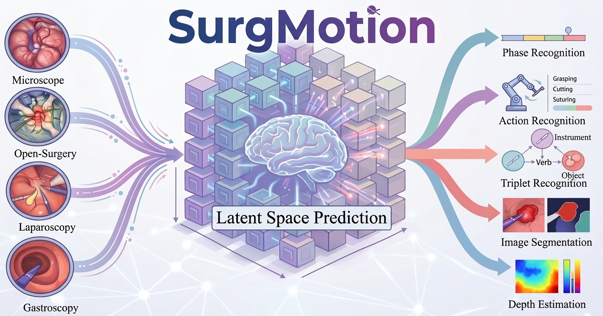
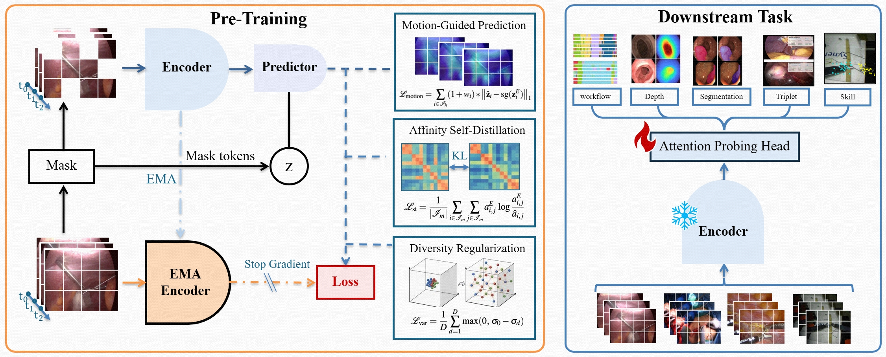

<div align="center">
<h1>SurgMotion: A Video-Native Foundation Model for Universal Understanding of Surgical Videos</h1>

<a href="https://surgmotion.cares-copilot.com/"></a>
<a href="https://arxiv.org/abs/2602.05638"></a>
<a href="https://github.com/CAIR-HKISI/SurgMotion"></a>
<a href="https://huggingface.co/CAIR-HKISI/SurgMotion"></a>

</div>




**SurgMotion** is a video-native foundation model that shifts the learning paradigm from pixel-level reconstruction to latent motion prediction, with technical innovations tailored to surgical videos, built on top of [V-JEPA 2](https://github.com/facebookresearch/vjepa2).

## Model Overview

Key innovations:
- **Latent motion prediction** — shifts from pixel-level reconstruction to abstract motion forecasting in latent space
- **Flow-Guided Latent Prediction** — a novel objective that prevents feature collapse in homogeneous surgical tissue regions
- **Pre-trained on SurgMotion-15M** — the largest multi-modal surgical video dataset to date (15M frames, 3,658 hours, 13+ anatomical regions)

### Model Variants

| Variant | Backbone | Parameters | Pre-training Data |
|---------|----------|------------|-------------------|
| SurgMotion-L | ViT-Large | 300M | SurgMotion-15M |
| SurgMotion-H | ViT-Huge | 600M | SurgMotion-15M |
| SurgMotion-G | ViT-Giant | 1.01B | SurgMotion-15M |

### Architecture

1. **Video Encoder (ViT)** — processes 64-frame surgical video clips into spatiotemporal token sequences
2. **Latent Predictor** — predicts masked region representations in latent space guided by optical flow
3. **Probing Head** — lightweight temporal classifier for downstream phase recognition

### Performance Highlights

SurgMotion achieves **SOTA on 5 out of 6** representative surgical tasks (workflow, action, segmentation, triplet, skill), while remaining competitive on depth estimation. For detailed results, see our [paper](https://arxiv.org/abs/2602.05638) and [project page](https://surgmotion.cares-copilot.com/).

## Quick Start

- **Setup**:
  - [Environment Installation](#environment-installation)
  - [Data Preparation](#data-preparation)
- **Usage**:
  - [Run Foundation Probing](#run-foundation-probing)
- **Extend**:
  - [Add a New Dataset](#add-a-new-dataset)
  - [Add a New Foundation Model](#add-a-new-foundation-model)

## Project Structure

```
SurgMotion/
├── src/                        # V-JEPA2 core: ViT, VideoMAE, datasets, masks
├── evals/                      # Evaluation entry points & foundation phase probing
│   ├── main.py                 # Single-task entry: python -m evals.main --fname <yaml>
│   └── foundation_phase_probing/
│       ├── eval.py             # Probing evaluation logic
│       ├── models.py           # Probing head definitions
│       └── modelcustom/        # Per-model adapters (DINOv2, EndoViT, SurgVLP, …)
├── configs/
│   └── foundation_model_probing/
│       ├── dinov2/             # YAML configs per dataset
│       ├── dinov3/
│       ├── endofm/
│       ├── …                   # 15 model families supported
│       └── videomaev2/
├── data_process/               # End-to-end dataset preprocessing scripts
│   ├── autolaparo_prepare.py
│   ├── cholect80_prepare.py
│   ├── egosurgery_prepare.py
│   ├── m2cai2016_prepare.py
│   ├── ophnet_prepare.py
│   ├── pitvis_prepare.py
│   ├── pmlr50_prepare.py
│   ├── polypdiag_prepare.py
│   └── surgicalactions160_prepare.py
├── scripts/                    # Batch probing & environment setup shells
├── foundation_models/          # Third-party model implementations (git submodules)
├── data/                       # Data directory
├── setup.py                    # pip install -e .
└── requirements.txt            # All dependencies (excluding EndoMamba)
```

## Environment Installation

### Main Environment (Recommended)

```bash
conda create -n SurgMotion python=3.12 -y
conda activate SurgMotion

# Install PyTorch matching your CUDA version first:
# https://pytorch.org/get-started/locally/

pip install -e .
```

### EndoMamba (Separate Environment)

EndoMamba requires its own Conda env with custom CUDA extensions. **Do not mix** with the main environment.

```bash
bash scripts/srun_endomamba_complie.sh   # Creates env + compiles extensions
conda activate endomamba                 # Use only for EndoMamba configs
```

### Dependency Files

| File | Scope |
|------|-------|
| `requirements.txt` | All dependencies (V-JEPA2 core + foundation probing) |
| `setup.py` | `pip install -e .` reads `requirements.txt` automatically |

> EndoMamba has its own isolated environment managed by `scripts/srun_endomamba_complie.sh`.

## Data Preparation

All preprocessing scripts under `data_process/` follow a unified end-to-end pipeline:

```bash
python data_process/<dataset>_prepare.py [OPTIONS]
```

Each script supports `--help` and produces:
- `clip_infos/*.txt` — per-case frame path lists for clip-style loaders
- `{train,val,test}_metadata.csv` — standardized CSV with columns:

| Column | Description |
|--------|-------------|
| `Index` | Row index within the split (0-based) |
| `clip_path` | Path to the clip's frame list txt |
| `label` | Integer phase / class id |
| `label_name` | Human-readable phase name |
| `case_id` | Numeric case / video identifier |
| `clip_idx` | Clip index within the case (0 for single-clip) |

### Supported Datasets

| Dataset | Script | Domain | Phases |
|---------|--------|--------|--------|
| AutoLaparo | `autolaparo_prepare.py` | Laparoscopic hysterectomy | 7 |
| Cholec80 | `cholect80_prepare.py` | Laparoscopic cholecystectomy | 7 |
| EgoSurgery | `egosurgery_prepare.py` | Egocentric open surgery | 9 |
| M2CAI2016 | `m2cai2016_prepare.py` | Laparoscopic cholecystectomy | 8 |
| OphNet2024 | `ophnet_prepare.py` | Ophthalmic surgery | 96 |
| PitVis | `pitvis_prepare.py` | Pituitary neurosurgery | 12 |
| PmLR50 | `pmlr50_prepare.py` | Laparoscopic liver resection | 5 |
| PolypDiag | `polypdiag_prepare.py` | GI endoscopy (binary) | 2 |
| SurgicalActions160 | `surgicalactions160_prepare.py` | Surgical action recognition | N (auto) |

### Example: Prepare Cholec80

```bash
python data_process/cholect80_prepare.py \
    --frames_root data/Surge_Frames/Cholec80/frames \
    --annot_dir data/Landscopy/cholec80/phase_annotations \
    --output_dir data/Surge_Frames/Cholec80 \
    --debug
```

## Run Foundation Probing

### Single Task

```bash
python -m evals.main \
    --fname configs/foundation_model_probing/dinov3/AutoLaparo/dinov3_vitl_64f_autolaparo.yaml \
    --devices cuda:0
```

### Batch (Multi-GPU Parallel)

Edit the task list in `scripts/run_foundation_probing.sh`, then run:

```bash
bash scripts/run_foundation_probing.sh
```

The script auto-assigns one GPU per task from the available pool (default: all 8 GPUs). Logs are saved under `logs/foundation/<Dataset>/`.

### Supported Foundation Models

| Model | Identifier | Architecture | Source |
|-------|-----------|--------------|--------|
| DINOv2 / DINOv3 | `dinov3` | ViT-L, ViT-H | [GitHub](https://github.com/facebookresearch/dinov2) |
| Endo-FM | `endofm` | ViT-B | [GitHub](https://github.com/med-air/Endo-FM) |
| EndoMamba | `endomamba` | Mamba-S | [GitHub](https://github.com/TianCuteQY/EndoMamba) |
| EndoSSL | `endossl` | ViT-L | [GitHub](https://github.com/royhirsch/endossl) |
| EndoViT | `endovit` | ViT-L | [GitHub](https://github.com/DominikBatic/EndoViT) |
| GastroNet | `gastronet` | ViT-S | [IEEE Xplore](https://ieeexplore.ieee.org/document/10243003) |
| GSViT | `gsvit` | ViT | [GitHub](https://github.com/SamuelSchmidgall/GSViT) |
| SelfSupSurg | `selfsupsurg` | ResNet-50 | [GitHub](https://github.com/CAMMA-public/SelfSupSurg) |
| SurgeNet | `surgenet` | CAFormer-XL, ConvNeXtV2 | [GitHub](https://github.com/TimJaspers0801/SurgeNet) |
| SurgVLP | `surgvlp` | ResNet-50 | [GitHub](https://github.com/CAMMA-public/SurgVLP) |
| VideoMAEv2 | `videomaev2` | ViT-L, ViT-H, ViT-g | [GitHub](https://github.com/OpenGVLab/VideoMAEv2) |

## Add a New Dataset

1. Create `data_process/<dataset>_prepare.py` following the existing template (see `polypdiag_prepare.py` for reference).
2. Output standardized CSVs with the 6-column schema (`Index`, `clip_path`, `label`, `label_name`, `case_id`, `clip_idx`).
3. Create YAML configs under `configs/foundation_model_probing/<model>/<Dataset>/`.

## Add a New Foundation Model

1. Write an adapter under `evals/foundation_phase_probing/modelcustom/adapters/`:

```python
# Input:  any shape, e.g. [B, C, F, H, W]
# Output: [B, F*N, D]  (spatial-temporal tokens)
```

2. Register the model in `evals/foundation_phase_probing/modelcustom/foundation_model_wrapper.py`:

```python
elif model_type == 'your_model':
    from .adapters.your_model_adapter import YourModelAdapter
    adapter = YourModelAdapter.from_config(
        resolution=resolution,
        checkpoint=checkpoint,
        model_name=model_name
    )
```

3. Create YAML configs under `configs/foundation_model_probing/your_model/<Dataset>/`.
4. Add entries to `scripts/run_foundation_probing.sh` and run.

## Acknowledgement

This project is built on top of [V-JEPA 2](https://github.com/facebookresearch/vjepa2) by Meta. We sincerely thank the authors of the following works whose open-source models were used in our benchmark:

[DINOv2](https://github.com/facebookresearch/dinov2) | [Endo-FM](https://github.com/med-air/Endo-FM) | [EndoMamba](https://github.com/TianCuteQY/EndoMamba) | [EndoSSL](https://github.com/royhirsch/endossl) | [EndoViT](https://github.com/DominikBatic/EndoViT) | [GastroNet](https://ieeexplore.ieee.org/document/10243003) | [GSViT](https://github.com/SamuelSchmidgall/GSViT) | [SelfSupSurg](https://github.com/CAMMA-public/SelfSupSurg) | [SurgeNet](https://github.com/TimJaspers0801/SurgeNet) | [SurgVISTA](https://github.com/isyangshu/SurgVISTA) | [SurgVLP](https://github.com/CAMMA-public/SurgVLP) | [VideoMAEv2](https://github.com/OpenGVLab/VideoMAEv2)

## Reference

If you find our work helpful, please cite our [paper](https://arxiv.org/abs/2602.05638).

```bibtex
@misc{wu2026unisurgvideonativefoundationmodel,
      title={UniSurg: A Video-Native Foundation Model for Universal Understanding of Surgical Videos}, 
      author={Jinlin Wu and Felix Holm and Chuxi Chen and An Wang and Yaxin Hu and Xiaofan Ye and Zelin Zang and Miao Xu and Lihua Zhou and Huai Liao and Danny T. M. Chan and Ming Feng and Wai S. Poon and Hongliang Ren and Dong Yi and Nassir Navab and Gaofeng Meng and Jiebo Luo and Hongbin Liu and Zhen Lei},
      year={2026},
      eprint={2602.05638},
      archivePrefix={arXiv},
      primaryClass={cs.CV},
      url={https://arxiv.org/abs/2602.05638}, 
}
```

---

<div align="center">

**Centre for Artificial Intelligence and Robotics, Hong Kong Institute of Science and Innovation, CAS**

[Project Page](https://surgmotion.cares-copilot.com/) | [Paper](https://arxiv.org/abs/2602.05638) | [Hugging Face](https://huggingface.co/CAIR-HKISI/SurgMotion)

</div>
