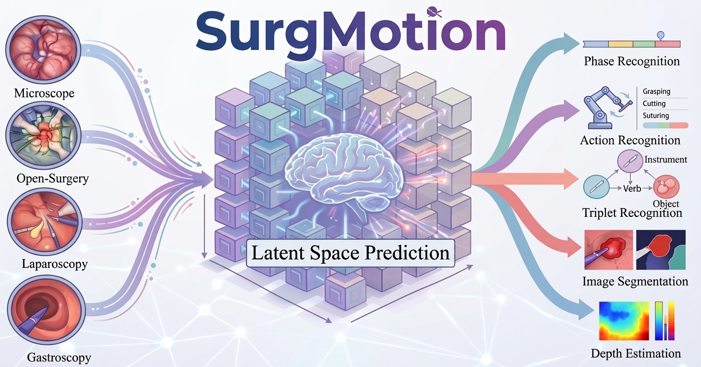
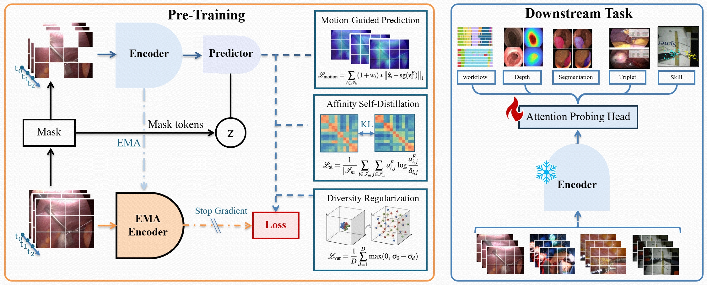

<div align="center">
<h1>SurgMotion: A Video-Native Foundation Model for Universal Understanding of Surgical Videos</h1>

<a href="https://surgmotion.cares-copilot.com/"></a>
<a href="https://arxiv.org/abs/2602.05638"></a>
<a href="https://github.com/CAIR-HKISI/SurgMotion"></a>
<a href="https://huggingface.co/CAIR-HKISI/SurgMotion"></a>

</div>



**SurgMotion** is a video-native foundation model that shifts the learning paradigm from pixel-level reconstruction to latent motion prediction, with technical innovations tailored to surgical videos, built on top of [V-JEPA 2](https://github.com/facebookresearch/vjepa2).

## Model Overview

Key innovations:
- **Latent motion prediction** — shifts from pixel-level reconstruction to abstract motion forecasting in latent space
- **Flow-Guided Latent Prediction** — a novel objective that prevents feature collapse in homogeneous surgical tissue regions
- **Pre-trained on SurgMotion-15M** — the largest multi-modal surgical video dataset to date (15M frames, 3,658 hours, 13+ anatomical regions)

### Model Variants

| Variant | Backbone | Parameters | Pre-training Data |
|---------|----------|------------|-------------------|
|  [SurgMotion-L](https://huggingface.co/CAIR-HKISI/SurgMotion/blob/main/SurgMotion-vitl.pt)  | ViT-Large | 300M | SurgMotion-15M |
|  [SurgMotion-G](https://huggingface.co/CAIR-HKISI/SurgMotion/blob/main/SurgMotion-vitg-xformer.pt)  | ViT-Giant-xformer | 1B | SurgMotion-15M |

### Architecture

1. **Video Encoder (ViT)** — processes 64-frame surgical video clips into spatiotemporal token sequences
2. **Latent Predictor** — predicts masked region representations in latent space guided by optical flow
3. **Probing Head** — lightweight temporal classifier for downstream phase recognition

### Performance Highlights

SurgMotion achieves **SOTA on all** representative surgical tasks (workflow, action, segmentation, triplet, skill, depth estimation). For detailed results, see our [paper](https://arxiv.org/abs/2602.05638) and [project page](https://surgmotion.cares-copilot.com/).

## Quick Start

- **Setup**:
  - [Environment Installation](#environment-installation)
  - [Data Preparation](#data-preparation)
- **Usage**:
  - [Run Foundation Probing](#run-foundation-probing)
- **Extend**:
  - [Add a New Dataset](#add-a-new-dataset)
  - [Add a New Foundation Model](#add-a-new-foundation-model)

## Project Structure

```
SurgMotion/
├── src/                        # V-JEPA2 core: ViT, VideoMAE, datasets, masks
├── evals/                      # Evaluation entry points & foundation phase probing
│   ├── main.py                 # Single-task entry: python -m evals.main --fname <yaml>
│   └── foundation_phase_probing/
│       ├── eval.py             # Probing evaluation logic
│       ├── models.py           # Probing head definitions
│       └── modelcustom/        # Per-model adapters (SurgMotion, DINOv3, SurgVLP, …)
├── configs/
│   └── foundation_model_probing/
│       ├── surgmotion/         # YAML configs per dataset
│       ├── dinov3/
│       ├── endofm/
│       ├── …                   # 15 model families supported
│       └── videomaev2/
├── data_process/               # End-to-end dataset preprocessing scripts
│   ├── autolaparo_prepare.py
│   ├── cholect80_prepare.py
│   ├── egosurgery_prepare.py
│   ├── m2cai2016_prepare.py
│   ├── ophnet_prepare.py
│   ├── pitvis_prepare.py
│   ├── pmlr50_prepare.py
│   ├── polypdiag_prepare.py
│   └── surgicalactions160_prepare.py
├── ckpts/                      # Store all the foundation models
├── scripts/                    # Batch probing & environment setup shells
├── foundation_models/          # Third-party model implementations (git submodules)
├── data/                       # Data directory
├── setup.py                    # pip install -e .
└── requirements.txt            # All dependencies (excluding EndoMamba)
```

## Environment Installation

### Main Environment (Recommended)

```bash
conda create -n SurgMotion python=3.12 -y
conda activate SurgMotion

# Install PyTorch matching your CUDA version first:
# https://pytorch.org/get-started/locally/

pip install -e .
```

### EndoMamba (Separate Environment)

EndoMamba requires its own Conda env with custom CUDA extensions. **Do not mix** with the main environment.

```bash
bash scripts/srun_endomamba_complie.sh   # Creates env + compiles extensions
conda activate endomamba                 # Use only for EndoMamba configs
```

### Dependency Files

| File | Scope |
|------|-------|
| `requirements.txt` | All dependencies (V-JEPA2 core + foundation probing) |
| `setup.py` | `pip install -e .` reads `requirements.txt` automatically |

> EndoMamba has its own isolated environment managed by `scripts/srun_endomamba_complie.sh`.

## Data Preparation

All preprocessing scripts under `data_process/` now follow a unified end-to-end pipeline and support one-command execution:

```bash
python data_process/<dataset>_prepare.py --step all
```

Common step options:

```bash
--step all|frames|metadata|clips
--window_size 64
--stride 1
--fps 1
--no_padding
```

Typical outputs:
- `clip_infos/*.txt` — per-case frame path lists
- `{train,val,test}_metadata.csv` — frame-level metadata for dense clip generation
- `clips_<window_size>f/{train,val,test}_dense_<window_size>f_detailed.csv`
- `clips_<window_size>f/clip_dense_<window_size>f_info/{train,val,test}/*.txt`

Frame-level metadata schema:

| Column | Description |
|--------|-------------|
| `Case_ID` | Numeric case / video identifier |
| `Frame_Path` | Absolute/relative frame image path |
| `Phase_GT` | Integer phase/class id for this frame |
| `Phase_Name` | Human-readable phase/class name |

### Dense Sampling Strategy

We use an online workflow recognition setting:
- A clip is a sliding temporal window.
- The **last frame** in the window is the target frame to predict.
- Previous frames in the window are temporal context.
- Neighboring windows overlap.

For `window_size=64`, `stride=1`:
- clip 1: frames `[0, ..., 63]`
- clip 2: frames `[1, ..., 64]`
- clip 3: frames `[2, ..., 65]`

Padding at video start:
- If the early timeline does not have enough preceding frames, we pad the window by repeating the current window's last frame.
- This behavior is enabled by default; use `--no_padding` to disable.

### Clip Labeling Rule

For phase recognition:
- Frames are sampled at `1 fps`.
- Clip label = label of the clip's **last frame**.

Example:
- frames `0-40`: Phase 0
- frames `41-63`: Phase 1
- clip `[0, ..., 63]` label is **Phase 1**.

### Notes on Performance Gaps

If reproduced results are lower than expected, dense sampling mismatch is one possible source, but not the only one. We also recommend checking:
- longer training schedules (e.g., 2 / 4 / 8 epochs)
- class balancing / class weighting strategy

Class weighting can strongly affect surgical long-tail performance. See implementation in [`evals/foundation_phase_probing/eval.py`](https://github.com/CAIR-HKISI/SurgMotion/blob/main/evals/foundation_phase_probing/eval.py#L41C1-L41C83).

### Supported Datasets

Most datasets already provide extracted frames in `data/Surge_Frames/...`. The pipelines read annotations and frames; frame extraction from videos (`--step frames`) is **optional** and only needed if you have raw mp4 files.

| Dataset | Script | Annotation Path | Frames Path | Extract? |
|---------|--------|-----------------|-------------|----------|
| Cholec80 | `cholect80_prepare.py` | `cholec80/phase_annotations` | `Surge_Frames/Cholec80/frames/{videoXX}/` | Optional |
| AutoLaparo | `autolaparo_prepare.py` | `autolaparo/task1/labels` | `Surge_Frames/AutoLaparo/frames/{NN}/` | Optional |
| M2CAI2016 | `m2cai2016_prepare.py` | `m2cai16/{train,test}_dataset` | `Surge_Frames/M2CAI16/frames/{video}/` | No |
| EgoSurgery | `egosurgery_prepare.py` | `EgoSurgery/annotations/phase` | `Surge_Frames/EgoSurgery/frames/{video_id}/` | No |
| PitVis | `pitvis_prepare.py` | `pitvits/26531686` | `Surge_Frames/PitVis/frames/video_{XX}/` | No |
| OphNet2024 | `ophnet_prepare.py` | `OphNet2024_trimmed_phase/*.csv` | `Surge_Frames/OphNet2024_phase/frames/` | No |
| PmLR50 | `pmlr50_prepare.py` | `PmLR50/PmLR50/labels/*.pickle` | `Surge_Frames/PmLR50/frames/{XX}/` | No |
| SurgicalActions160 | `surgicalactions160_prepare.py` | (from video filenames) | `Surge_Frames/SurgicalActions160_v1/frames/` | **Yes** |
| PolypDiag | `polypdiag_prepare.py` | (from video filenames) | `Surge_Frames/PolypDiag/frames/` | **Yes** |

All annotation and frame paths above are relative to the `data/` directory (e.g., `data/Landscopy/cholec80/phase_annotations`).

### Pipeline behavior

The scripts are built around **frame-based** clip CSVs. Depending on whether you already have **extracted frames** or only **raw videos**, use the path that matches your data.

#### 1) Frames-first input (recommended default)

You already have image sequences under `--frames_root` (e.g. `data/Surge_Frames/...`).

| Step | What it does |
|------|----------------|
| `--step all` | Runs **`metadata` → `clips`**. Does **not** decode videos in most scripts (see table below). |
| `--step metadata` | Builds `{train,val,test}_metadata.csv` from annotations + `Frame_Path`. |
| `--step clips` | Writes dense sliding-window clip lists and detailed CSVs via `gen_clips.py`. |

**Typical command:** `python data_process/<dataset>_prepare.py --step all` with correct `--frames_root` / annotation paths. No `--videos_dir` needed.

#### 2) Videos-first input (optional extraction)

You only have **`.mp4` files** and need JPEG/PNG frames under `--frames_root` first.

| Step | What it does |
|------|----------------|
| `--step frames` | Decodes videos → frames (needs a directory of mp4s; flag name varies by script, usually `--videos_dir` or dataset-specific video roots). |
| Then | Run `--step all` **or** `--step metadata` then `--step clips` on the extracted frames. |

**Typical two-stage flow:**

```bash
python data_process/<dataset>_prepare.py --step frames --videos_dir /path/to/mp4s  # if supported
python data_process/<dataset>_prepare.py --step all
```

#### 3) How `--step all` treats frame extraction

| Script | `--step all` runs video→frames? | Notes |
|--------|----------------------------------|--------|
| `cholect80_prepare.py` | **Yes, if** `--videos_dir` exists | If the directory is missing, extraction is skipped and existing `--frames_root` is assumed. |
| `autolaparo_prepare.py` | **No** | Use `--step frames` explicitly, then `--step all` or `metadata` + `clips`. |
| `m2cai2016_prepare.py`, `pitvis_prepare.py`, `ophnet_prepare.py`, `pmlr50_prepare.py`, `egosurgery_prepare.py` | **No** | Same as AutoLaparo: extraction is **only** `--step frames`. |
| `surgicalactions160_prepare.py`, `polypdiag_prepare.py` | **Yes** | `all` runs the full video pipeline (including optional `rename` where applicable), then metadata and clips. |

#### Quick reference: flags vs. input type

| You have | Use |
|----------|-----|
| Frames on disk | `--step all` (or `metadata` + `clips` only). Point `--frames_root` at the image folders. |
| Only videos | `--step frames` first (where supported), with the script’s video path argument, then `--step all`. |
| Bundled `Surge_Frames` + annotations | Frames-first row above; **no** extraction step. |

### Example: Prepare Cholec80

```bash
python data_process/cholect80_prepare.py \
    --frames_root data/Surge_Frames/Cholec80/frames \
    --annot_dir data/Landscopy/cholec80/phase_annotations \
    --output_dir data/Surge_Frames/Cholec80 \
    --step all \
    --debug
```

### Example: Prepare SurgicalActions160 (with extraction)

```bash
python data_process/surgicalactions160_prepare.py \
    --src_root data/Landscopy/SurgicalActions160 \
    --fps 1 \
    --step all
```

## Run Foundation Probing

### Supported Foundation Models

| Model | Identifier | Architecture | Source |
|-------|-----------|--------------|--------|
| DINOv3 | `dinov3` | ViT-L, ViT-H | [GitHub](https://github.com/facebookresearch/dinov3) |
| Endo-FM | `endofm` | ViT-B | [GitHub](https://github.com/med-air/Endo-FM) |
| EndoMamba | `endomamba` | Mamba-S | [GitHub](https://github.com/TianCuteQY/EndoMamba) |
| EndoSSL | `endossl` | ViT-L | [GitHub](https://github.com/royhirsch/endossl) |
| EndoViT | `endovit` | ViT-L | [GitHub](https://github.com/DominikBatic/EndoViT) |
| GastroNet | `gastronet` | ViT-S | [IEEE Xplore](https://ieeexplore.ieee.org/document/10243003) |
| GSViT | `gsvit` | ViT | [GitHub](https://github.com/SamuelSchmidgall/GSViT) |
| SelfSupSurg | `selfsupsurg` | ResNet-50 | [GitHub](https://github.com/CAMMA-public/SelfSupSurg) |
| SurgeNet | `surgenet` | CAFormer-XL, ConvNeXtV2 | [GitHub](https://github.com/TimJaspers0801/SurgeNet) |
| SurgVLP | `surgvlp` | ResNet-50 | [GitHub](https://github.com/CAMMA-public/SurgVLP) |
| VideoMAEv2 | `videomaev2` | ViT-L, ViT-H, ViT-g | [GitHub](https://github.com/OpenGVLab/VideoMAEv2) |

### Model Preparation

1. Download Model Weights from their corresponding repos.
2. Put the Model under the ckpts folder:
```bash
# For SurgMotion
SurgMotion/ckpts 

# For Other Foundation Models
SurgMotion/ckpts/ckpts_foundation 
```
3. Make sure the model path align with the corresponding adapters.py:
```bash
# For Other Foundation Models
SurgMotion/evals/foundation_phase_probing/modelcustom/adapters
```

### Single Task

```bash
# SurgMotion
python -m evals.main \
    --fname configs/foundation_model_probing/surgmotion/AutoLaparo/surgmotion_vitl_64f_autolaparo.yaml \
    --devices cuda:0

# Dinov3
python -m evals.main \
    --fname configs/foundation_model_probing/dinov3/AutoLaparo/dinov3_vitl_64f_autolaparo.yaml \
    --devices cuda:0
```

### Batch (Multi-GPU Parallel)

Edit the task list in `scripts/run_foundation_probing.sh`, then run:

```bash
bash scripts/run_foundation_probing.sh
```

The script auto-assigns one GPU per task from the available pool (default: all 8 GPUs). Logs are saved under `logs/foundation/<Dataset>/`.

## Add a New Dataset

1. Create `data_process/<dataset>_prepare.py` following the existing template (see `polypdiag_prepare.py` for reference).
2. Output frame-level metadata CSVs with schema: `Case_ID`, `Frame_Path`, `Phase_GT`, `Phase_Name`.
3. Generate dense clips via `gen_clips.py` (or `--step clips`) to produce `clips_64f/*_dense_64f_detailed.csv`.
4. Create YAML configs under `configs/foundation_model_probing/<model>/<Dataset>/`.

## Add a New Foundation Model

1. Write an adapter under `evals/foundation_phase_probing/modelcustom/adapters/`:

```python
# Input:  any shape, e.g. [B, C, F, H, W]
# Output: [B, F*N, D]  (spatial-temporal tokens)
```

2. Register the model in `evals/foundation_phase_probing/modelcustom/foundation_model_wrapper.py`:

```python
elif model_type == 'your_model':
    from .adapters.your_model_adapter import YourModelAdapter
    adapter = YourModelAdapter.from_config(
        resolution=resolution,
        checkpoint=checkpoint,
        model_name=model_name
    )
```

3. Create YAML configs under `configs/foundation_model_probing/your_model/<Dataset>/`.
4. Add entries to `scripts/run_foundation_probing.sh` and run.

## Acknowledgement

This project is built on top of [V-JEPA 2](https://github.com/facebookresearch/vjepa2) by Meta. We sincerely thank the authors of the following works whose open-source models were used in our benchmark:

[DINOv2](https://github.com/facebookresearch/dinov2) | [Endo-FM](https://github.com/med-air/Endo-FM) | [EndoMamba](https://github.com/TianCuteQY/EndoMamba) | [EndoSSL](https://github.com/royhirsch/endossl) | [EndoViT](https://github.com/DominikBatic/EndoViT) | [GastroNet](https://ieeexplore.ieee.org/document/10243003) | [GSViT](https://github.com/SamuelSchmidgall/GSViT) | [SelfSupSurg](https://github.com/CAMMA-public/SelfSupSurg) | [SurgeNet](https://github.com/TimJaspers0801/SurgeNet) | [SurgVISTA](https://github.com/isyangshu/SurgVISTA) | [SurgVLP](https://github.com/CAMMA-public/SurgVLP) | [VideoMAEv2](https://github.com/OpenGVLab/VideoMAEv2)

## Reference

If you find our work helpful, please cite our [paper](https://arxiv.org/abs/2602.05638).

```bibtex
@misc{wu2026surgmotionvideonativefoundationmodel,
      title={SurgMotion: A Video-Native Foundation Model for Universal Understanding of Surgical Videos}, 
      author={Jinlin Wu and Felix Holm and Chuxi Chen and An Wang and Yaxin Hu and Xiaofan Ye and Zelin Zang and Miao Xu and Lihua Zhou and Huai Liao and Danny T. M. Chan and Ming Feng and Wai S. Poon and Hongliang Ren and Dong Yi and Nassir Navab and Gaofeng Meng and Jiebo Luo and Hongbin Liu and Zhen Lei},
      year={2026},
      eprint={2602.05638},
      archivePrefix={arXiv},
      primaryClass={cs.CV},
      url={https://arxiv.org/abs/2602.05638}, 
}
```

---

<div align="center">

**Centre for Artificial Intelligence and Robotics, Hong Kong Institute of Science and Innovation, CAS**

[Project Page](https://surgmotion.cares-copilot.com/) | [Paper](https://arxiv.org/abs/2602.05638) | [Hugging Face](https://huggingface.co/CAIR-HKISI/SurgMotion)

</div>
